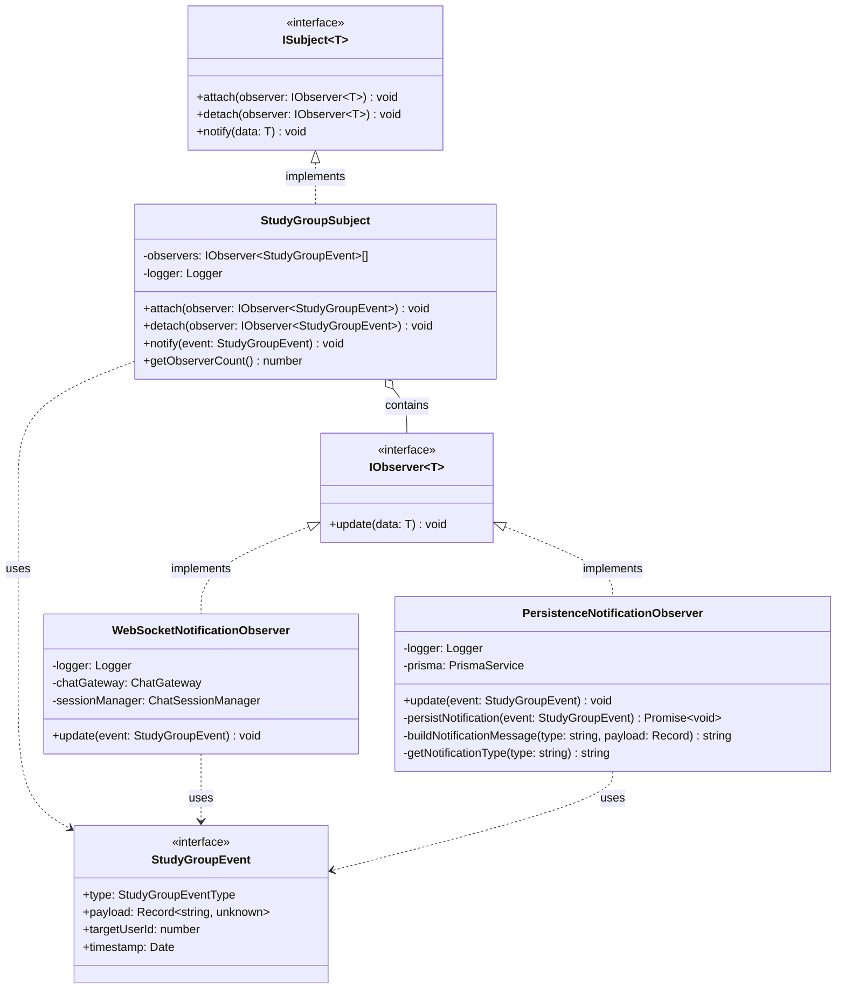
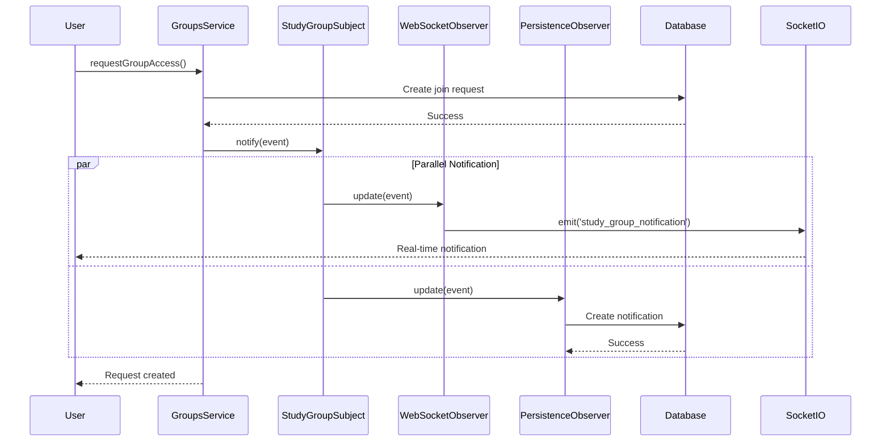

# Observer Pattern - Study Group Notifications

## Overview

This module implements the **Observer Pattern** for study group event notifications. When group-related events occur (join requests, member acceptance/rejection, admin transfers), the system notifies relevant users through multiple channels (WebSocket and database persistence).

## Architecture

### UML Class Diagram



## Event Types

The system supports 5 types of study group events:

| Event Type | Description | Target User |
|------------|-------------|-------------|
| `JOIN_REQUEST` | User requests to join a group | Group owner |
| `MEMBER_ACCEPTED` | Join request was accepted | Requester |
| `MEMBER_REJECTED` | Join request was rejected | Requester |
| `ADMIN_TRANSFER_REQUESTED` | Ownership transfer initiated | New owner |
| `ADMIN_TRANSFER_ACCEPTED` | Ownership transfer completed | Previous owner |

## Components

### 1. StudyGroupSubject (Subject)

**Responsibility**: Manages observers and notifies them when group events occur.

**Key Features**:
- Prevents duplicate observer attachments
- Isolates observer errors (one failure doesn't affect others)
- Provides observer count for testing/debugging

**Usage**:
```typescript
// In GroupsService constructor
constructor(
  private studyGroupSubject: StudyGroupSubject,
) {}

// Notify observers of an event
this.studyGroupSubject.notify({
  type: 'JOIN_REQUEST',
  payload: {
    id_request: joinRequest.id_request,
    id_group: groupId,
    group_name: 'Study Group',
    requester_id: userId,
    requester_name: 'John Doe',
  },
  targetUserId: ownerId,
  timestamp: new Date(),
});
```

### 2. WebSocketNotificationObserver (Observer)

**Responsibility**: Sends real-time notifications to users via WebSocket.

**Key Features**:
- Retrieves all active sockets for the target user (multi-device support)
- Handles offline users gracefully (logs and continues)
- Emits `'study_group_notification'` event to client

**Dependencies**:
- `ChatGateway`: Socket.IO gateway for emitting events
- `ChatSessionManager`: Tracks user socket connections

### 3. PersistenceNotificationObserver (Observer)

**Responsibility**: Persists notifications to the database for offline users and history.

**Key Features**:
- Fire-and-forget pattern (doesn't block on DB operations)
- Builds human-readable Spanish messages
- Maps event types to database notification types

**Database Fields**:
- `id_user`: Target user ID
- `message`: Human-readable Spanish message
- `is_read`: false (unread by default)
- `notification_type`: Event type in lowercase
- `related_entity_id`: Group ID

## Integration

### Module Initialization

The `GroupsModule` implements `OnModuleInit` to attach observers during startup:

```typescript
@Module({
  providers: [
    StudyGroupSubject,
    WebSocketNotificationObserver,
    PersistenceNotificationObserver,
  ],
})
export class GroupsModule implements OnModuleInit {
  constructor(
    private readonly subject: StudyGroupSubject,
    private readonly webSocketObserver: WebSocketNotificationObserver,
    private readonly persistenceObserver: PersistenceNotificationObserver,
  ) {}

  onModuleInit() {
    this.subject.attach(this.webSocketObserver);
    this.subject.attach(this.persistenceObserver);
  }
}
```

### Service Integration

The `GroupsService` injects the subject and calls `notify()` after successful operations:

```typescript
// Example: Request to join group
async requestGroupAccess(userId: number, groupId: number) {
  // ... business logic ...
  
  // Notify owner via Observer pattern
  this.studyGroupSubject.notify({
    type: 'JOIN_REQUEST',
    payload: { /* event data */ },
    targetUserId: group.owner_id,
    timestamp: new Date(),
  });
}
```

## Notification Flow



## Testing

### Unit Tests

- **Subject Tests**: Verify attach/detach/notify behavior
- **Observer Tests**: Mock dependencies and verify update() calls
- **Error Isolation**: Verify one observer failure doesn't affect others

### Integration Tests

- **Service Tests**: Verify notify() is called with correct event data
- **Module Tests**: Verify observers are attached during initialization

### Manual Testing

1. Request to join a group → Owner receives WebSocket + DB notification
2. Accept join request → Requester receives WebSocket + DB notification
3. Reject join request → Requester receives WebSocket + DB notification
4. Transfer ownership → Both parties receive WebSocket + DB notifications
5. Test with offline user → Notification saved to DB only
6. Test with multi-device user → Notification sent to all sockets

## Benefits

1. **Decoupling**: GroupsService doesn't know about notification channels
2. **Extensibility**: Easy to add new observers (email, push notifications, etc.)
3. **Reliability**: Database persistence ensures no lost notifications
4. **Real-time**: WebSocket provides instant feedback to online users
5. **Error Isolation**: One observer failure doesn't affect others

## Future Enhancements

- **Email Observer**: Send email notifications for important events
- **Push Notification Observer**: Send mobile push notifications
- **Analytics Observer**: Track event metrics for reporting
- **Audit Log Observer**: Log all group events for compliance
