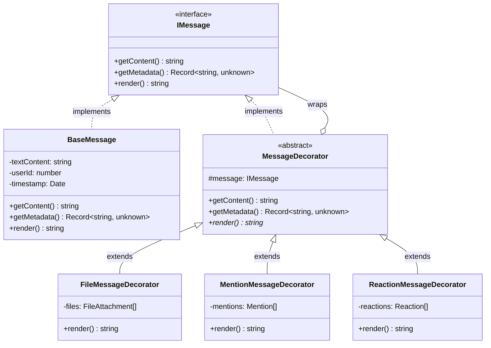

# Message Decorator Pattern

This directory implements the **Decorator Pattern** for chat messages, allowing modular composition of message capabilities (file attachments, user mentions, emoji reactions) without modifying the base message class.

## Architecture

The implementation follows the classic Decorator pattern with:

- **IMessage**: Interface defining the contract for all message objects
- **BaseMessage**: Concrete component implementing plain text messages
- **MessageDecorator**: Abstract decorator base class
- **Concrete Decorators**: FileMessageDecorator, MentionMessageDecorator, ReactionMessageDecorator

## UML Class Diagram



## Usage Example

```typescript
import { BaseMessage } from './base-message';
import { FileMessageDecorator } from './file-message.decorator';
import { MentionMessageDecorator } from './mention-message.decorator';

// Create base message
let message = new BaseMessage('Hello @user!', 1, new Date());

// Add file attachment
message = new FileMessageDecorator(message, [
  { url: 'https://...', name: 'file.pdf', mimeType: 'application/pdf', size: 1024 }
]);

// Add user mention
message = new MentionMessageDecorator(message, [
  { userId: 2, displayName: 'John Doe', position: 6 }
]);

// Render as JSON
const json = message.render();
// Output: {"text":"Hello @user!","files":[...],"mentions":[...]}
```

## Integration with MessagesService

The `MessagesService.applyDecorators()` method automatically instantiates the decorator chain based on the `MessageDto` fields:

1. Creates `BaseMessage` with text content
2. Applies `FileMessageDecorator` if `dto.files` is present
3. Applies `MentionMessageDecorator` if `dto.mentions` is present
4. Applies `ReactionMessageDecorator` if `dto.reactions` is present
5. Generates `rendered_content` JSON string
6. Persists to database with `rendered_content` field

## Rendered Content Structure

The `render()` method returns a JSON string with the following structure:

```typescript
interface RenderedMessage {
  text: string;
  files?: Array<{
    url: string;
    name: string;
    mimeType: string;
    size: number;
  }>;
  mentions?: Array<{
    userId: number;
    displayName: string;
    position: number;
  }>;
  reactions?: Array<{
    emoji: string;
    count: number;
    users: number[];
  }>;
}
```

## Design Principles

- **Open/Closed Principle**: New decorators can be added without modifying existing code
- **Single Responsibility**: Each decorator handles one specific capability
- **Composition over Inheritance**: Decorators are composed dynamically at runtime
- **Zero-Any Policy**: All types are explicitly defined (no `any` usage)

## Testing

See `__tests__/` directory for:
- Unit tests for each decorator class
- Composition tests (multiple decorators)
- Integration tests with MessagesService
