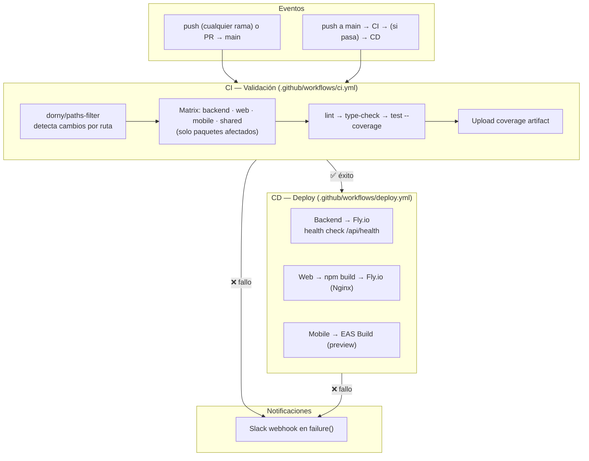

# CI/CD — Uniconnect Monorepo

## Arquitectura



---

## Secretos de GitHub

Configurar en: Settings → Secrets and variables → Actions

| Secreto | Usado en | Descripción |
|---|---|---|
| `FLY_API_TOKEN` | CD (Backend + Web) | Token de Fly.io para `flyctl deploy`. Generar en: [fly.io → Tokens](https://fly.io/docs/security/tokens/) |
| `EXPO_TOKEN` | CD (Mobile) | Token de EAS para `eas build`. Generar en: [expo.dev → Settings → Access tokens](https://expo.dev/accounts) |
| `SLACK_WEBHOOK` | CI + CD | Webhook URL de Slack para notificaciones de fallo. Crear en: [Slack → Apps → Incoming Webhooks](https://api.slack.com/messaging/webhooks) |

> **⚠️ Los secretos nunca deben estar hardcodeados ni committeados al repositorio.**

---

## Manual de Emergencia — Rollback

### Backend (Fly.io)

```bash
# 1. Ver imágenes disponibles
flyctl releases list

# 2. Deployar una versión anterior
flyctl deploy --remote-only --image registry.fly.io/uniconnect-backend-core-black-wave-3099@sha256:<prev-digest>

# 3. Verificar health
curl --retry 6 --retry-delay 10 https://uniconnect-backend-core-black-wave-3099.fly.dev/api/health
```

### Web (Fly.io)

```bash
# Listar releases
flyctl releases list

# Rollback al release anterior
flyctl deploy --remote-only --image registry.fly.io/uniconnect-frontend-uc@sha256:<prev-digest>
```

### Mobile (EAS Build)

No hay rollback automático vía EAS. Estrategias:

1. **Build anterior**: Desde [expo.dev → Builds](https://expo.dev/accounts), descargar APK/IPA de un build exitoso anterior.
2. **Rebuild manual**: Disparar EAS Build con el commit anterior:
   ```bash
   git checkout <prev-commit> -- Frontend/Frontend-mobile/
   npx eas build --platform all --profile preview --non-interactive
   ```

### Rollback Automático (workflow manual)

Disparar desde GitHub Actions → `Rollback` workflow:

```
Workflow: Rollback
Inputs:
  app:     backend | web | mobile
  version: SHA256 digest de la imagen anterior (o commit hash para mobile)
```

---

## Scripts de Verificación

Scripts estandarizados en cada paquete del monorepo:

| Paquete | `npm run lint` | `npm run type-check` | `npm run test` |
|---|---|---|---|
| **Backend** | `eslint "{src,...}/**/*.ts" --fix` | `tsc --noEmit` | `jest` |
| **Frontend-web** | `eslint .` | `tsc -b` | `vitest run` |
| **Frontend-mobile** | `eslint "src/**/*.{ts,tsx}" --fix` | `tsc --noEmit` | `jest` |
| **Shared** | `eslint "src/**/*.ts" --fix` | `tsc --noEmit` (script: `typecheck`) | `jest` |

### Desde la raíz del monorepo

```bash
npm run typecheck:all   # shared + web
npm run test:all        # mobile + web
```

### Por paquete

```bash
cd Backend && npm run lint && npm run type-check && npm test
cd Frontend/Frontend-web && npm run lint && npm run type-check && npm test
cd Frontend/Frontend-mobile && npm run lint && npm run type-check && npm test
cd Frontend/shared && npm run lint && npm run typecheck && npm test
```

---

## Resumen de Cambios (US-INF09)

### Workflows

| Archivo | Propósito |
|---|---|
| `.github/workflows/ci.yml` | Validación en PRs: lint + type-check + test con cobertura, solo paquetes afectados |
| `.github/workflows/deploy.yml` | Deploy a producción, gatillado por CI exitoso en main: Backend (Fly.io), Web (Fly.io), Mobile (EAS) |

> **Nota:** El workflow `deploy.yml` no ejecuta tests directamente. Los tests corren en `ci.yml` mediante una matriz paralela (backend, web, mobile, shared). `deploy.yml` se activa vía `workflow_run` solo si CI completa exitosamente. Esta separación permite detectar fallos en cada paquete por separado y evita duplicar la matriz de pruebas dentro del pipeline de deploy.

### Archivos eliminados

| Archivo | Motivo |
|---|---|
| `eas.json` (raíz) | Huérfano, 0 bytes |
| `Frontend/.github/workflows/ci-cd.yml` | Legacy frontend workflow — eliminado |

### Scripts agregados

| Paquete | Scripts |
|---|---|
| **Backend** | `type-check` |
| **Frontend-web** | `type-check` |
| **Frontend-mobile** | `lint`, `type-check` |
| **Shared** | `lint` |
