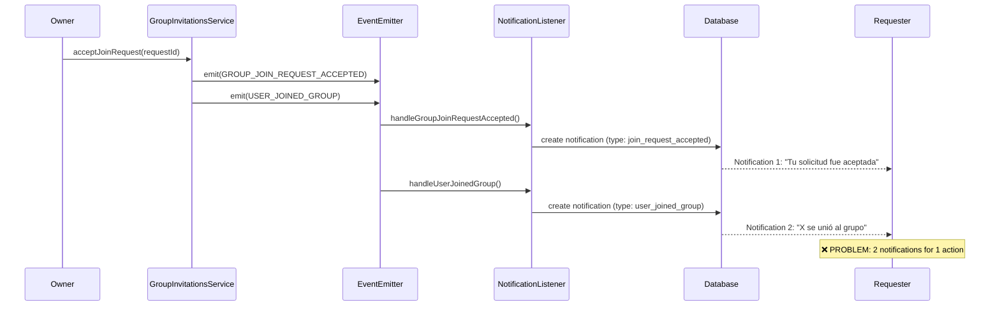
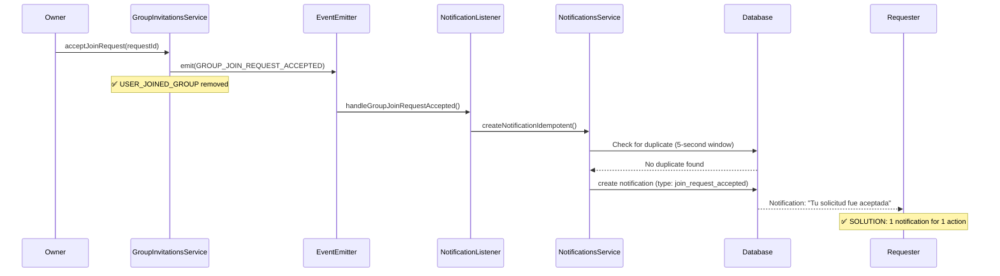
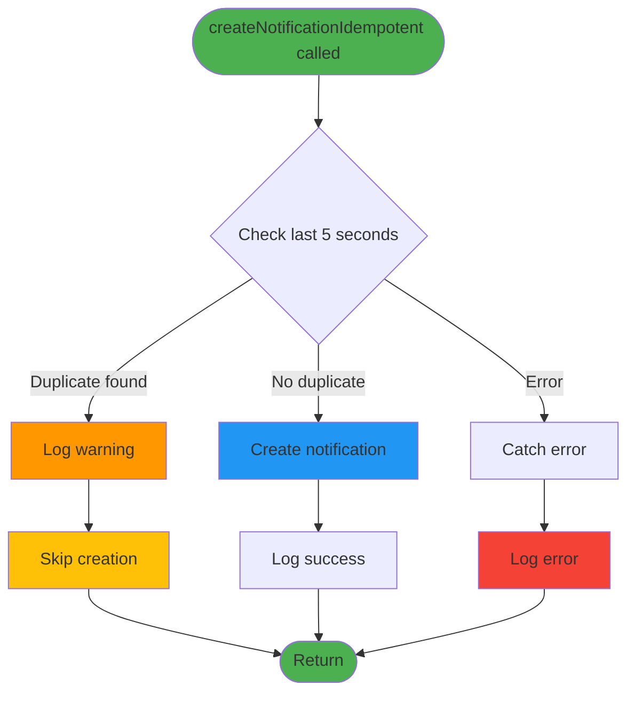
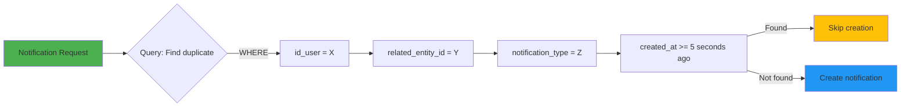
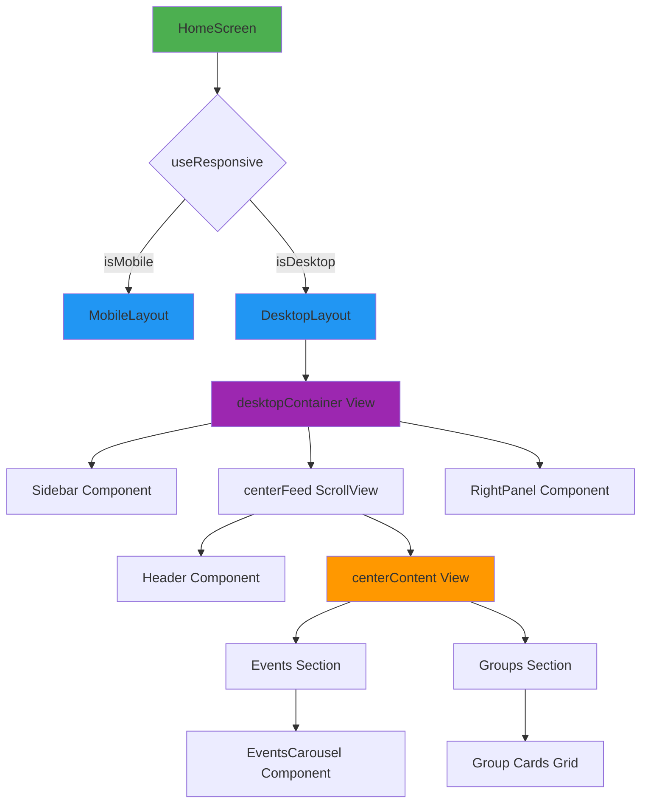
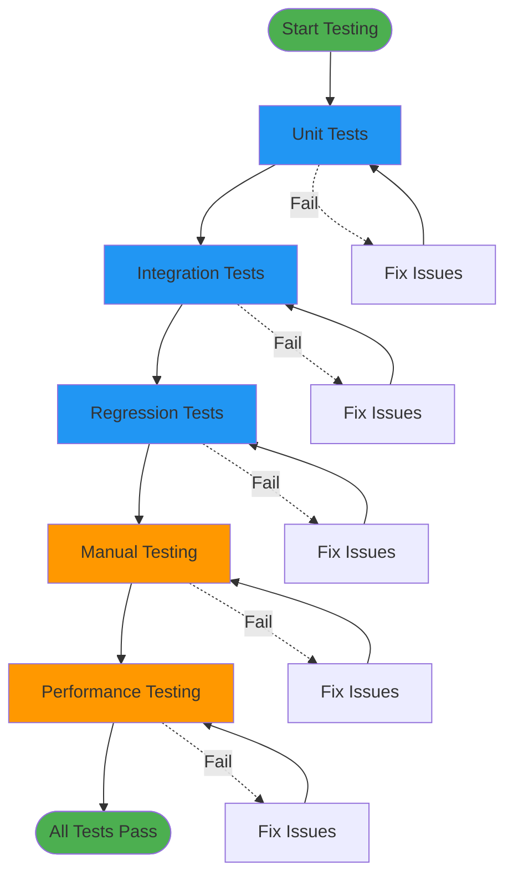

# Visual Diagrams: Backend Duplication and Home Grid

**Change ID**: `fix-backend-duplication-and-home-grid`

---

## 🔄 Backend Event Flow

### BEFORE (Current - Duplicate Notifications)



### AFTER (Proposed - Single Notification)



---

## 🛡️ Idempotency Flow

### Duplicate Prevention Logic



### Database Query Flow



---

## 🖥️ Frontend Layout Transformation

### BEFORE (Current - Empty Center)

```
┌──────────────────────────────────────────────────────────────────┐
│                                                                  │
│  ┌─────────┐  ┌────────────────────────────┐  ┌──────────────┐  │
│  │         │  │                            │  │              │  │
│  │ Sidebar │  │      ❌ EMPTY CENTER       │  │ Right Panel  │  │
│  │ 240px   │  │      (No max-width)        │  │ 300px        │  │
│  │         │  │                            │  │              │  │
│  │ Nav     │  │  Header                    │  │ Featured     │  │
│  │ Links   │  │                            │  │ Groups       │  │
│  │         │  │  Events Carousel           │  │              │  │
│  │ • Home  │  │  (Stretched too wide)      │  │ • Group 1    │  │
│  │ • Events│  │                            │  │ • Group 2    │  │
│  │ • Groups│  │  ⚠️ Visual gaps            │  │ • Group 3    │  │
│  │ • Comm. │  │  ⚠️ Poor hierarchy         │  │              │  │
│  │         │  │                            │  │              │  │
│  │         │  │                            │  │              │  │
│  └─────────┘  └────────────────────────────┘  └──────────────┘  │
│                                                                  │
└──────────────────────────────────────────────────────────────────┘
```

### AFTER (Proposed - Centered Content)

```
┌──────────────────────────────────────────────────────────────────┐
│                                                                  │
│  ┌─────────┐  ┌────────────────────────────┐  ┌──────────────┐  │
│  │         │  │                            │  │              │  │
│  │ Sidebar │  │  ✅ CENTERED FEED          │  │ Right Panel  │  │
│  │ 240px   │  │  (max-width: 800px)        │  │ 300px        │  │
│  │         │  │                            │  │              │  │
│  │ Nav     │  │  ┌──────────────────────┐  │  │ Featured     │  │
│  │ Links   │  │  │ Header               │  │  │ Groups       │  │
│  │         │  │  └──────────────────────┘  │  │              │  │
│  │ • Home  │  │  ┌──────────────────────┐  │  │ • Group 1    │  │
│  │ • Events│  │  │ Events Carousel      │  │  │ • Group 2    │  │
│  │ • Groups│  │  │ (Optimal width)      │  │  │ • Group 3    │  │
│  │ • Comm. │  │  └──────────────────────┘  │  │ • Group 4    │  │
│  │ • Conn. │  │  ┌──────────────────────┐  │  │ • Group 5    │  │
│  │ • Notif.│  │  │ Groups Section       │  │  │ • Group 6    │  │
│  │ • Prof. │  │  │ (4 cards grid)       │  │  │ • Group 7    │  │
│  │         │  │  └──────────────────────┘  │  │ • Group 8    │  │
│  │         │  │                            │  │              │  │
│  └─────────┘  └────────────────────────────┘  └──────────────┘  │
│                                                                  │
└──────────────────────────────────────────────────────────────────┘
```

---

## 📐 Layout Dimensions

### Desktop Grid Breakdown

```
┌─────────────────────────────────────────────────────────┐
│                    Total Width: 1340px                  │
├──────────┬──────────────────────────────┬───────────────┤
│ Sidebar  │       Center Feed            │  Right Panel  │
│ 240px    │       max 800px              │  300px        │
│ (Fixed)  │       (Flexible)             │  (Fixed)      │
└──────────┴──────────────────────────────┴───────────────┘

Responsive Breakpoints:
┌─────────────┬──────────┬─────────────────────────────────┐
│ Screen Size │ Layout   │ Columns                         │
├─────────────┼──────────┼─────────────────────────────────┤
│ < 768px     │ Mobile   │ Single (full width)             │
│ 768-1023px  │ Mobile   │ Single (full width)             │
│ ≥ 1024px    │ Desktop  │ 3-column (240 + 800 + 300)      │
└─────────────┴──────────┴─────────────────────────────────┘
```

---

## 🔄 Component Hierarchy

### Desktop Layout Structure



---

## 📊 Notification Flow Comparison

### Current Flow (Duplicate Notifications)

```
Join Request Acceptance:
┌─────────────────────────────────────────────────────────┐
│ Owner accepts request                                   │
└────────────────┬────────────────────────────────────────┘
                 │
                 ├─► Event 1: GROUP_JOIN_REQUEST_ACCEPTED
                 │   └─► Notification 1 to Requester ✅
                 │
                 └─► Event 2: USER_JOINED_GROUP
                     └─► Notification 2 to Requester ❌ (DUPLICATE)
                     └─► Notification to each Member ✅

Result: Requester gets 2 notifications (1 duplicate)
```

### Proposed Flow (Single Notification)

```
Join Request Acceptance:
┌─────────────────────────────────────────────────────────┐
│ Owner accepts request                                   │
└────────────────┬────────────────────────────────────────┘
                 │
                 └─► Event: GROUP_JOIN_REQUEST_ACCEPTED
                     └─► Notification to Requester ✅
                     └─► Idempotency check prevents duplicates ✅

Result: Requester gets 1 notification (no duplicates)
```

---

## 🎯 Success Metrics

### Backend Improvements

```
┌─────────────────────────────────────────────────────────┐
│ Metric                    │ Before  │ After  │ Change   │
├───────────────────────────┼─────────┼────────┼──────────┤
│ Notifications per join    │ 2       │ 1      │ -50%     │
│ DB writes per join        │ 2       │ 1      │ -50%     │
│ Duplicate rate            │ 100%    │ 0%     │ -100%    │
│ Query overhead            │ 0ms     │ <5ms   │ +5ms     │
└─────────────────────────────────────────────────────────┘
```

### Frontend Improvements

```
┌─────────────────────────────────────────────────────────┐
│ Metric                    │ Before  │ After  │ Change   │
├───────────────────────────┼─────────┼────────┼──────────┤
│ Center content width      │ Flex    │ 800px  │ Fixed    │
│ Empty space               │ Yes     │ No     │ ✅       │
│ Visual hierarchy          │ Poor    │ Good   │ ✅       │
│ Mobile layout             │ Good    │ Good   │ No change│
└─────────────────────────────────────────────────────────┘
```

---

## 🧪 Testing Strategy

### Backend Testing Flow



---

**Diagrams Complete** ✅  
**Ready for Implementation** ✅
